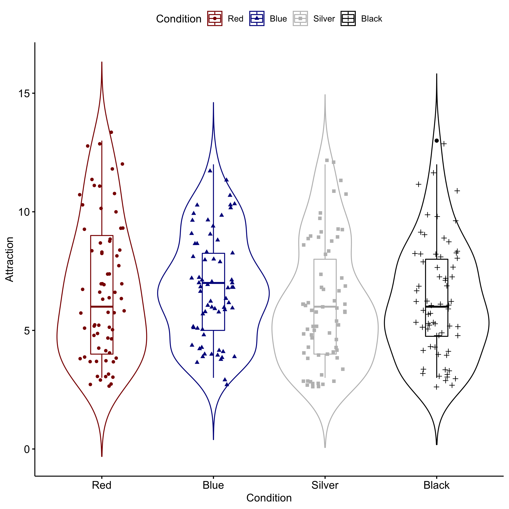

```{r setup, include=FALSE}
options(htmltools.dir.version = FALSE)
knitr::opts_chunk$set(echo = TRUE)
```


```{r, load_refs, echo=FALSE, cache=FALSE, warning=F, results='hide', message=F}
library(RefManageR)
BibOptions(check.entries = FALSE,
           bib.style = "authoryear",
           cite.style = 'alphabetic',
           hyperlink = FALSE,
           dashed = FALSE,
           style = "html")
myBib <- ReadBib("./myBib.bib", check = FALSE)
```


## Outline of today.

* Intro.

* Identifying a topic.

* Formulating a research question.

* Summary.

We'll use '[zeetings](www.zeetings.com/tvpollet)' to make it a bit more interactive. Go to [www.zeetings.com/tvpollet](www.zeetings.com/tvpollet) for the interactive bit.

--> Goal for today: give you some strategies for developing a rationale.

```{r, out.width = "250px", echo=FALSE, fig.align='center'}
knitr::include_graphics("https://media.giphy.com/media/RHLcOWQ4xqyOKvqzAc/giphy.gif")
```

???
No need to extensive notes. References at end of slides.

---
## Who am I... ?

* I teach [Advanced Quantitative methods](https://tvpollet.github.io/PY0794). Also, I was the 'Director of Learning & Teaching: Experience' and taught the option course Research on Human Nature (PY0552).

--

* I am an interdisciplinary behavioural scientist and I have published [too many papers](https://tvpollet.github.io/papers). I work mostly on social relationships (friendships, loneliness, social networks, jealousy, attraction in romantic relationships), but have ventured out (e.g., research methodology, sex ratios, left-handedness, body image (height), personality, PTSD, 'cyberpsychology',...)

--

* Some of the things published are Bachelor projects (!) (needless to say that those students did fairly well.) 

```{r, out.width = "350px", echo=FALSE, fig.align='center'}
knitr::include_graphics("https://media.giphy.com/media/xTiTnmyOHAeSeqkbcI/giphy.gif")
```

---
## Who are you?

So which of the following best describes your proposed interest (pick a word! e.g., addiction, cognition, personality).

**Zeetings Question**

```{r, out.width = "600px", echo=FALSE, fig.align='center'}
knitr::include_graphics("https://media.giphy.com/media/3o72EVymX8u70s22mQ/giphy.gif")
```

---
## Why should this session matter to you?

* You have developed your skills in Year 2: Lab Skills Experience, Research Design, Data Collection/ Collation, Data Analyses, Report Writing, Lab Report Assessment.

--

* For the next 6 months, you will be applying all those skills in your final-year project.

--

* Some practical tips and some things from my own experience to help you.

```{r, out.width = "550px", echo=FALSE, fig.align='center'}
knitr::include_graphics("https://media.giphy.com/media/bQvbdd3YgDbOM/giphy.gif")
```

---
## Meeting your supervisor.

* Have you met your supervisor? 

**Zeetings question**

--

* Arrange an appointment to discuss your project proposal.

--

* Aim to design a manageable, empirical study:

To discuss: 
  1. Still what you want to do? 
  2. Read the literature?
  3. Theory - hypothesis
  4. What is your research question?
  5. How will your method answer the question?


```{r, out.width = "200px", echo=FALSE, fig.align='center'}
knitr::include_graphics("https://media.giphy.com/media/ytkAEO6oNLVNC/giphy.gif")
```

---
## Identifying a topic (Kinmond, 2012: 26-ff).

* Derive research questions from the literature, instead of: 'armchair speculation' or anecdotal musing.

--

* Important to take account of the research that has already been conducted in the area. Do a thorough literature search!

--

* Avoid running the risk of investigating a research question which has been addressed and answered already! --> Some things are 'solved'!

---
## Read and synthesise the literature.

* Start with a paper you found interesting and work your way back. Who do they cite? Who cites them? 

* Google Scholar. Use other database such as 'Web of Science', 'EBSCO', 'Pubmed' (medical).

* Good keywords. 

* Ask a librarian! 

```{r, out.width = "300px", echo=FALSE, fig.align='center'}
knitr::include_graphics("https://media.giphy.com/media/QVxeI5qhmlXAkqaAro/giphy.gif")
```

---
## Help!

You have looked and nothing 'relevant' is there.

* Are you super-lucky and did nobody ever look at your research question?

* Did you use a good combination of search terms?

* Discuss with your prospective supervisor, if you find a dearth of research in that area? (Is it... 'solved'? 'out of fashion'? 'bad(?) research'?) 

```{r, out.width = "300px", echo=FALSE, fig.align='center'}
knitr::include_graphics("https://media.giphy.com/media/phJ6eMRFYI6CQ/giphy.gif")
```

---
## Evaluating the literature.

* Triage: useful, not useful, maybe useful.

--

* Look out for review papers: e.g., _Annual Review of 'X'_ , _Psychological Bulletin_, _Psychological Review_, _Clinical Psychology Review_ .  --> (Systematic) reviews and meta-analyses. 

--

* Use a reference manager to order your chaos. (Endnote; [Mendeley](www.mendeley.com); [Zotero](www.zotero.org))

--

* Make a [board](https://www.literatureandlatte.com/scrivener/overview)

```{r, out.width = "300px", echo=FALSE, fig.align='center'}

```

---
## The importance of replication.

* You found a study but it's not particularly good! (clues: smallish sample size, incredibly big effects,....)

--

* It is extremely valuable to replicate earlier published studies. Discuss with your supervisor - Do you think the findings of the original paper hold?

--

* So your question could just be: does this hold up?

```{r, out.width = "375px", echo=FALSE, fig.align='center'}
knitr::include_graphics("https://media.giphy.com/media/6kwKHH08kPP4k/giphy.gif")
```

---
## Example 1: Red laptops... .

* Social Psychological research: 'Red' is suggested to enhance attractiveness (e.g., [Elliot & Niesta, 2008](https://www.bryanburnham.net/wp-content/uploads/2014/01/Elliot-Niesta-2008-JPSP-.pdf))

--

* In an extension, Lin (2014) found: _"Women carrying products in red only affected how men, but not women, perceived them."_

--

* Photo with woman holding a red laptop (vs. black, blue, or grey laptop) rated as significantly more attractive by the opposite gender.

```{r, out.width = "500px", echo=FALSE, fig.align='center'}

```

---
## Replication.

Study 1 carried out by 2 MSc. students in the Netherlands (N= 273). 

--

To the best degree possible, we followed the original study,... .

--

```{r, out.width = "450px", echo=FALSE, fig.align='center'}

```

---
## Extending previous research: Finding clues... .

* Discussion: Often has useful things in it: look for the limitations / future directions section in a paper

--

* What has been missed?

```{r, out.width = "450px", echo=FALSE, fig.align='center'}
knitr::include_graphics("https://media.giphy.com/media/l4pTibO1cY4d5aeyI/giphy.gif")
```

---
## Easy: Improved measurement.

* Often there is substantial mileage to be gained from testing the same thing but with a better measure. So, close to replication but with a twist. 

--

* For example, you found a study but it is using an unreliable measure. A clue could be the low reliability ( $\alpha$ ) of the measure.


```{r, out.width = "450px", echo=FALSE, fig.align='center'}
knitr::include_graphics("https://media.giphy.com/media/TvVck7lO4LDJS/giphy.gif")
```

---
## Easy: Different population(s) / differences according to 'X'?

* In the example above, Dutch students instead of Chinese students,... .

--

* 'Moderators':  is the effect stronger for certain subgroups (e.g., gender, culture, sexual orientation, marital status, ... .)

--

* Could the effect be explained by a 'third variable'? 

--

* Example: [Regulatory focus and every day risk taking](https://sbe.vu.nl/nl/Images/reg_focus_jw_tcm257-240967.pdf). (More advanced read [this](https://www.amazon.com/Book-Why-Science-Cause-Effect/dp/046509760X))

```{r, out.width = "450px", echo=FALSE, fig.align='center'}

```

**Zeetings question**

???
Mention 'prevention vs. promotion focus.'

---
## Easy - moderate: A different setting.

* Transpose to a different setting. Let's stick with risk taking for now,... . 

--

* An example from a (successful) Bachelor thesis project I supervised.

```{r, out.width = "500px", echo=FALSE, fig.align='center'}
knitr::include_graphics("https://media.giphy.com/media/fmT4vJRi9q2A0/giphy.gif")
```


---
## An example: Gender differences in every day risk taking behaviour in traffic.

We had previously done studies in the Netherlands: we found men are more likely to take risk in traffic than women do ([Cobey et al., 2013](https://journals.sagepub.com/doi/pdf/10.1177/147470491301100206)).

--

For example, we observed using lights on one's bike and gender (N=555 cyclists).

--

```{r, out.width = "325px", echo=FALSE, fig.align='center'}

```


---
## Bachelor project by O'Dowd.

Looking at unsafe crossing towards the metro station ('Jaywalking'), gender, and time of day (presence of daylight).

```{r, out.width = "250px", echo=FALSE, fig.align='center'}

```

--

What do you think we found? **Zeetings Question.**

--

Check paper [here](https://lebs.hbesj.org/index.php/lebs/article/view/lebs.2018.65/220).

---
## More difficult: Testing competing predictions! I

* A critical test (Dunbar, 1995). 'Theory A' says 'X', but 'Theory B' says 'Y'. Can you design a study which will allow us to test between A and B? Or what type of tests allow you to find evidence

--

* An example by [Dunbar et al. (2002)](https://brill.com/view/journals/beh/139/5/article-p695_8.xml): Vigilance in human groups.

--

* People continuously evaluate their environment ('Vigilance'). The authors tested competing hypotheses ('predation', 'friend searching', 'mate search', 'mate guard').

--

```{r, out.width = "400px", echo=FALSE, fig.align='center'}
knitr::include_graphics("https://media.giphy.com/media/3o85xCWv7CXY4qBQIg/giphy.gif")
```


---
## More difficult: Testing competing predictions! II

```{r, out.width = "500px", echo=FALSE, fig.align='center'}

```

--> Want to read more about scientific process and 'strong inference' , see [Platt, 1964](http://houdekpetr.cz/!data/papers/Platt%201964.pdf).

---
## Summary

* Do a thorough literature search!

* Do you 'trust' the finding? How can you improve the 'original' (measurement)?

* What is missing? Are there any potential confounds?

* Can you transpose the study to a different setting or different population?

* Does a competing theory suggest something else?

```{r, out.width = "300px", echo=FALSE, fig.align='center'}
knitr::include_graphics("https://media.giphy.com/media/dsKnRuALlWsZG/giphy.gif")
```

---
## Any Questions?

[http://tvpollet.github.io](http://tvpollet.github.io)

Twitter: @tvpollet

```{r, out.width = "600px", echo=FALSE, fig.align='center'}
knitr::include_graphics("https://media.giphy.com/media/3ohzdRoOp1FUYbtGDu/giphy.gif")
```

```{r, echo=F, warning=F,results='hide'}
# THOMAS COPY REFERENCE SLIDES
Citet(myBib, "Amir1990")
Citet(myBib, "Bakker2012")
Citet(myBib, "Barrett2013a")
Citet(myBib, "Baumeister2007")
Citet(myBib, "Chambers2017")
Citet(myBib, "Cobey2013a")
Citet(myBib, "Crump2018")
Citet(myBib, "Dunbar1995c")
Citet(myBib, "Dunbar2002")
Citet(myBib, "Dunbar2012a")
Citet(myBib, "Elliot2008")
Citet(myBib, "Evans2007")
Citet(myBib, "Forsyth1976")
Citet(myBib, "Fudge2014")
Citet(myBib, "Hamstra2011")
Citet(myBib, "Kinmond2012")
Citet(myBib, "Kinraide2003")
Citet(myBib, "Kuhn1962")
Citet(myBib, "Lakatos1974")
Citet(myBib, "Lin2014")
Citet(myBib, "Meehl1967")
Citet(myBib, "Meehl1990")
Citet(myBib, "Mertens2019")
Citet(myBib, "Neuman1997")
Citet(myBib, "Pearl2009c")
Citet(myBib, "Platt1964")
Citet(myBib, "Pollet2018")
Citet(myBib, "Pollet2019a")
Citet(myBib, "Pollet2019b")
Citet(myBib, "Popper1959")
Citet(myBib, "Pinker2015")
Citet(myBib, "Punch2000")
Citet(myBib, "Simmons2011")
Citet(myBib, "Tinbergen1963")
Citet(myBib, "Zwaan2018")
```

---
## References and further reading (errors = blame RefManageR)

```{r, 'refs', results='asis', echo=FALSE, warning=F}
PrintBibliography(myBib, start=1, end=5)
```
---
## More refs 1.

```{r, 'more refs', results='asis', echo=FALSE, warning=F}
PrintBibliography(myBib, start=6, end=10)
```

---
## More refs 2.

```{r, 'more refs 2', results='asis', echo=FALSE, warning=F}
PrintBibliography(myBib, start=11, end=15)
```

---
## More refs 3.

```{r, 'more refs 3', results='asis', echo=FALSE, warning=F}
PrintBibliography(myBib, start=16, end=20)
```

---
## More refs 4.

```{r, 'more refs 4', results='asis', echo=FALSE, warning=F}
PrintBibliography(myBib, start=21, end=25)
```

---
## More refs 5.

```{r, 'more refs 5', results='asis', echo=FALSE, warning=F}
PrintBibliography(myBib, start=26, end=30)
```

---
## More refs 6.

```{r, 'more refs 6', results='asis', echo=FALSE, warning=F}
PrintBibliography(myBib, start=31, end=35)
```
